# 🚢 Awesome Marine Procurement

    

**The Definitive Ecosystem Guide to Maritime E-Procurement, Ship Chandlery Purchasing, Requisition-to-PO Workflows & Fleet Purchasing Systems**

---

## 📌 Overview & SEO Summary

**Awesome Marine Procurement** is a curated registry tracking commercial **SaaS platforms**, enterprise ship-management suites, and **open-source projects** dedicated to **Maritime E-Procurement**. 

These specialized systems enable vessel owners, ship managers, marine superintendents, and ship chandlers to digitize purchasing for spare parts, provisions, deck stores, fuel (bunkering), and repair services—covering purchase requisitions (PR), Request for Quotes (RFQ), automated Purchase Orders (PO), IMPA/ISSA catalog coding, Inventory of Hazardous Materials (IHM) compliance, and EDI trading networks.

---

## 📑 Table of Contents

- [🌐 SaaS & Commercial Hosted Platforms](#-saas--commercial-hosted-platforms)
- [💻 Open-Source GitHub Repositories](#-open-source-github-repositories)
- [⚙️ Essential Building Blocks & Standards](#️-essential-building-blocks--standards)
- [🤝 How to Contribute](#-how-to-contribute)
- [📈 Star History](#-star-history)
- [💖 Support & Sponsorship](#-support--sponsorship)
- [🛡️ Disclaimer](#️-disclaimer)

---

## 🌐 SaaS & Commercial Hosted Platforms

> 📊 **Market Overview & Industry Structure**: The global marine procurement & maritime management software market is currently valued at **$2.5 Billion - $3.0 Billion** and is projected to exceed **$5.0+ Billion by 2030** (~10-12% CAGR). The market operates as a **moderately fragmented sector**, anchored by established commercial networks (such as ShipServ/Marcura and SpecTec AMOS) alongside specialized cloud-native SaaS platforms optimizing vessel OPEX and compliance.

Below is a structured analysis of leading commercial maritime e-procurement solutions, sorted by **Company Valuation / Annual Revenue (Descending)**:

| Platform / SaaS Product | Company Valuation / Revenue | Starting Pricing | Free Tier / Trial Limit | Key Features & Maritime Capabilities |
| :--- | :--- | :--- | :--- | :--- |
| **[ShipServ](https://www.shipserv.com/)** | **~$100M+ Revenue** *(Parent: Marcura Group, Valued ~$250M+)* | **~$150/vessel/mo** *(Buyers)* **~$500/year** *(Supplier Starter)* | **Free Basic Listing** for suppliers to build catalog profile & receive basic RFQs | World's leading maritime e-procurement trading network connecting 260+ fleet buyers and 73,000+ suppliers with automated RFQ/PO workflows. |
| **[SpecTec (AMOS)](https://www.spectec.com/)** | **~$40M+ Unit Revenue** *(Parent: Constellation Software - $7.5B+ Rev)* | **~$300/vessel/mo** *(Enterprise Tier)* | **14-Day Sandbox Demo** available upon enterprise sales request | Industry-standard Asset Management Operating System (AMOS) integrating vessel maintenance, spare parts purchasing, and regulatory compliance. |
| **[Helm CONNECT](https://www.helmoperations.com/)** | **~$25M+ Unit Revenue** *(Parent: Constellation Software - $7.5B+ Rev)* | **$99/vessel/mo** *(Maintenance Base)* | **30-Day Interactive Demo Trial** account for fleet operators | Modern fleet management suite for workboats and commercial vessels combining purchasing, inventory, asset maintenance, and compliance. |
| **[MESPAS Procurement](https://www.mespas.com/)** | **~$12M - $15M Revenue** | **~$100/vessel/mo** *(Base Suite)* | **30-Day Demo Access** for prospective ship managers & suppliers | Cloud-native maritime supply chain suite connecting ship, shore office, and suppliers with integrated stock management and automated PO generation. |
| **[Procureship](https://www.procureship.com/)** | **~$5M - $8M Revenue** *(Series A Venture Backed)* | **~$75/vessel/mo** *(Fixed Buyer Fee)* | **14-Day Full Trial** for fleet buyers; **100% Free Permanent Tier** for basic suppliers | ML-driven maritime e-procurement marketplace offering automated vendor recommendation, RFQ optimization, and integration with ship management ERPs. |

---

## 💻 Open-Source GitHub Repositories

While full-scale maritime trading networks are largely commercial, open-source solutions provide essential building blocks for fleet inventory tracking, ship chandlery management, and customized procurement workflows.

Below are top open-source projects relevant to maritime procurement, sorted by **GitHub Star Count (Descending)**:

| Repository / Project | GitHub Star Badge & Link | Primary Tech Stack | Description & Maritime Procurement Relevance |
| :--- | :--- | :--- | :--- |
| **[Odoo ERP Purchase](https://github.com/odoo/odoo)** |  | Python, JavaScript | Highly extensible open-source enterprise suite featuring Purchase and Stock modules customizable for marine fleet requisitions and supplier management. |
| **[ERPNext Procurement](https://github.com/frappe/erpnext)** |  | Python (Frappe framework) | Complete open ERP with purchase order approval workflows, multi-currency vendor portals, and stock inventory tracking suitable for ship managers. |
| **[InvenTree Parts & Stock](https://github.com/inventree/InvenTree)** |  | Python, Django, React | Open-source inventory management and spare parts tracking system ideal for vessel engine room inventory and spare parts cataloging. |
| **[OpenBoxes Supply Chain](https://github.com/openboxes/openboxes)** |  | Java, Grails | Supply chain and warehouse management application supporting purchase requisitions, stock movements, and multi-location vessel inventory. |
| **[Keelson Maritime Framework](https://github.com/RISE-Maritime/keelson)** |  | Rust, Python | Open-source data integration framework developed by RISE Maritime for vessel digital twins, sensor streams, and fleet connectivity. |
| **[Maritime Service Registry](https://github.com/maritimeconnectivity/ServiceRegistry)** |  | Java, Spring Boot | Core Service Registry for the Maritime Connectivity Platform (MCP) enabling standardized digital maritime services and document exchange. |
| **[DNV Maritime Schema](https://github.com/dnv-opensource/maritime-schema)** |  | JSON Schema, Python | DNV open-source data definitions and schemas for maritime operational data, safety interfaces, and vessel asset compliance. |
| **[Ship Chandler Hub](https://github.com/ryantusi/ShipChandlerHub)** |  | PHP, Laravel | Web application reference implementation for ship chandlers featuring IMPA-coded inventory management, order processing, and vessel tracking. |
| **[Ship & Cargo Matching](https://github.com/jasonliu62/ship-and-cargo-dev)** |  | Java, Spring Boot | Backend microservice platform for matching dry bulk cargo requisitions with vessel capacity and chartering schedules. |

---

## ⚙️ Essential Building Blocks & Standards

Building a modern custom marine purchasing architecture involves integrating core standards:

1. **Catalog & Coding Standards**:
   - **IMPA Marine Stores Guide (MSG)**: Standardized 6-digit codes used globally by ship chandlers and fleet managers.
   - **ISSA Code**: International Shipsuppliers & Services Association catalog classification.
2. **Approval & Workflow Engines**:
   - Multi-level vessel-to-shore approval chains (Master -> Superintendent -> Fleet Director -> PO Issued).
3. **EDI & Integration Interfaces**:
   - Maritime EDI document standards for electronic RFQs, Quotes, Purchase Orders, and Delivery Notes.

---

## 🤝 How to Contribute

Contributions are warmly welcomed! Help expand this list by following these steps:

1. Fork the repository.
2. Add your suggested SaaS product or Open-Source project to `README.md` following the table format.
3. Ensure description includes key maritime procurement capabilities and valid links.
4. Submit a Pull Request (PR) with a brief summary of the added solution.

---

## 📈 Star History

---

## 💖 Support & Sponsorship

If you find this repository helpful for your maritime technology research, ship management workflows, or procurement projects, please consider supporting the project!

- 🌟 **Star this repository** on GitHub to increase visibility.
- 🔀 **Fork & Share** it with maritime technology professionals.
- ☕ **Sponsor the Maintainer**: Support ongoing curation and open-source contributions via the [GitHub Sponsor Dashboard](https://github.com/sponsors/ishandutta2007).

---

## 🛡️ Disclaimer

- This is a community-curated collection intended for educational and research purposes.
- Marine procurement deals with safety-critical equipment, vessel spares, and international maritime safety regulations (e.g., SOLAS, MARPOL, IHM). Verify regulatory requirements and operational SLA before deploying systems on commercial vessels.

---

  Maintained with ❤️ for ship managers, fleet operators, maritime software engineers & marine procurement officers worldwide. 
  Discover more curated resources at <a href="https://github.com/ishandutta2007/Awesome-Awesome-Awesome">Awesome-Awesome-Awesome</a>.

